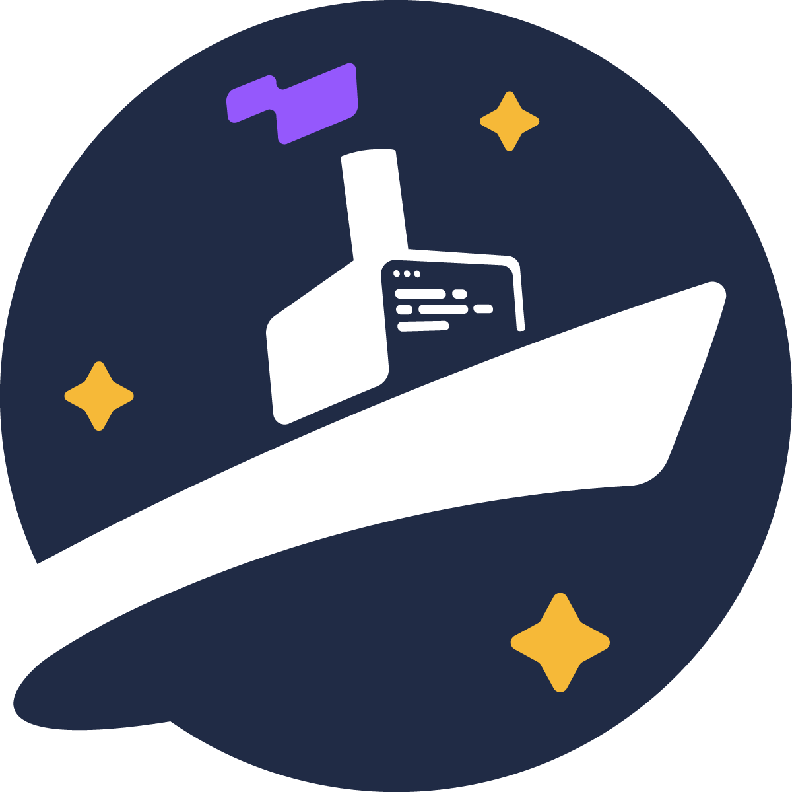

# Steamship Python SDK

🚢 [Steamship](https://steamship.com) is the fastest way to Build, Scale, and Monitor AI Agents.

This library is for:
- Building and deploying `Agents`, `Packages`, and `Plugins` on Steamship
- Making client calls to a Steamship `Package` from a Python environment

**Are you trying to build a Bot or Agent? Please check out our starter project and guidebook here:**

[Multimodal Agent Starter](https://github.com/steamship-core/multimodal-agent-starter)

[Agent Guidebook](https://www.steamship.com/learn/agent-guidebook)

**Are you trying to host a LangChain agent you've written?  Check out our LangChain compatibility library here:**

🚢 🦜️🔗 [Steamship-Langchain](https://github.com/steamship-core/steamship-langchain)

## Installing

Install via pip:

```
pip install steamship
```

## Documentation

[Full Documentation](https://docs.steamship.com/)

## Support and Discussion

Join our [Discord](https://steamship.com/discord)
