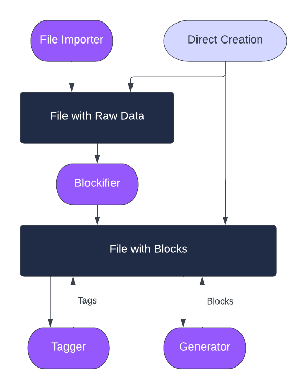

.. _Data Model:

Data Model
--------------------

There are only three core concepts you need to know.

#. :ref:`Files` are the top level object for storing data. A ``File`` can store raw data and an ordered list of ``Blocks``.
#. :ref:`Blocks` are chunks of content within a ``File``.  They can contain raw data and/or text, and an unordered set of ``Tags``.
#. :ref:`Tags` are typed annotations on a ``Block`` or ``File``.

The following diagram shows how data is created and used within Steamship:

#. File raw data can either be :ref:`created directly<Creating Files Directly>` or :ref:`imported via a File Importer<File Importers>`
#. Blocks on Files can either be :ref:`created directly<Creating Blocks>` or :ref:`created from raw data by a Blockifier<Blockifiers>`
#. Once you have blocks, you can run :ref:`Generators` and :ref:`Taggers`
#. Find data that you need by :ref:`querying<Queries>`
#. Index data for search with :ref:`the embedding search index<Embedding Search Index>`

.. toctree::
   :maxdepth: 1

   Workspaces <workspaces>
   Files <files>
   Blocks <blocks>
   Tags <tags>
   Querying Data <queries/index>

