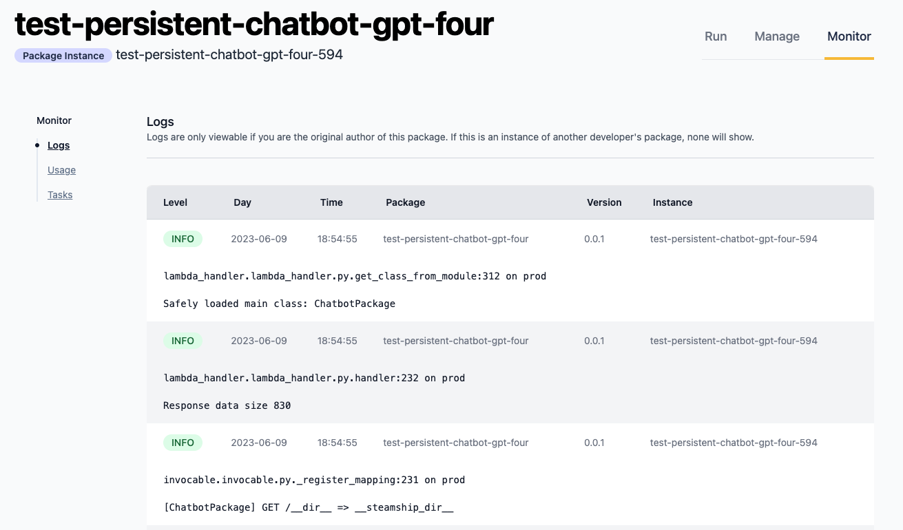
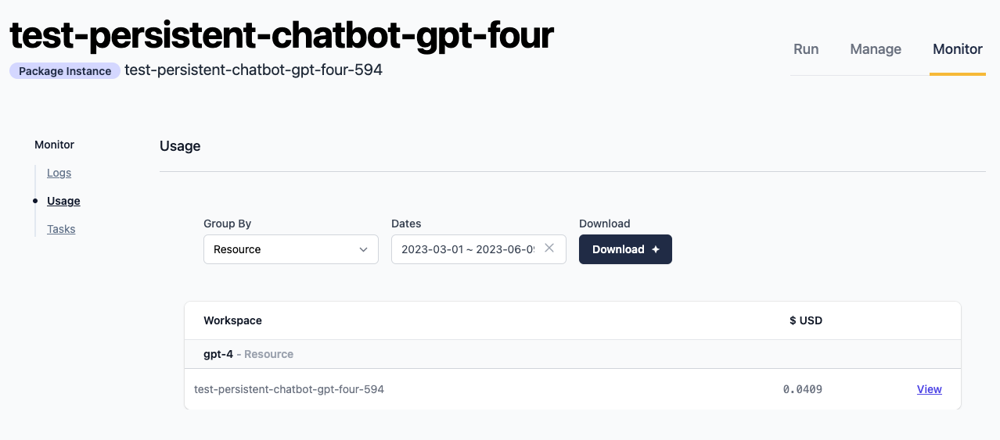
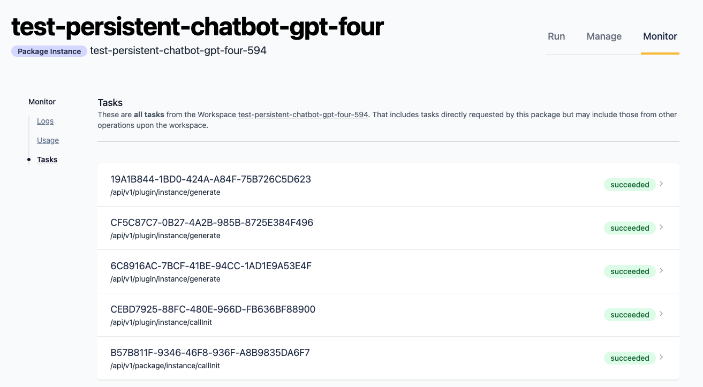

.. _Monitoring:

Monitoring
----------

Steamship enables easy monitoring of the health and behavior of your running
:ref:`Packages` and :ref:`Plugins`.

Monitoring via Web
~~~~~~~~~~~~~~~~~~

Steamship's website provides a hub for monitoring your packages and plugins. The monitoring page for
an instance provides application logs, a detailed breakdown of usage, and a view of related
:ref:`Tasks`.

To access the monitoring page for an instance, visit the instance page. For example, for a package instance,
you will need both the ``workspace_handle`` and ``package_instance_handle`` for your instance to find the URL.

Visit: ``https://www.steamship.com/workspaces/{workspace_handle}/packages/{package_instance_handle}/monitor`` to
access the Steamship monitoring.

Logs
^^^^

Usage
^^^^^

Tasks
^^^^^

Using Logging in Instances
~~~~~~~~~~~~~~~~~~~~~~~~~~

Our logging integration helps monitor the behavior of deployed instances, providing detailed
information about critical state in your deployments. You may add your own custom logging statements to
your :ref:`Packages` and :ref:`Plugins` to help in your development of new features, or to troubleshoot behavior in
existing instances.

Add custom logs using the Python ``logging`` library:

.. code-block:: python

   import logging
   logging.info(f'running agent with prompt: {prompt}')

It is also possible to add extra structured fields to your generated log entries to help in filtered retrieval later:

.. code-block:: python

   import logging
   logging.info(f'running agent with prompt: {prompt}',
                extra={'request_id': request_id, 'user': user}
   )

When a deployed instance is running, all logs at the ``INFO`` level and above will be generated, processed by Steamship,
and made available for retrieval within a few minutes.

Logs Retrieval with ``ship`` CLI
~~~~~~~~~~~~~~~~~~~~~~~~~~~~~~

To look up logs via the Steamship CLI, use the ``ship logs`` command. It will return a JSON object that contains
the relevant log entries.

Here is an example command to retrieve logs with extra fields in the example workspace ``steamship-example-logs-001``:

.. code-block:: bash

    ship logs -w steamship-example-logs-001 -f "request_id=99999999"

Because ``ship logs`` returns JSON, you can use `jq <https://jqlang.github.io/jq/>`_ to help trim the output to meet your needs:

.. code-block:: bash

    ship logs -w steamship-example-logs-001 -f "request_id=99999999" | jq '.entries[].message'

For full information on how to use ``ship logs``, run:

.. code-block:: bash

    ship logs --help