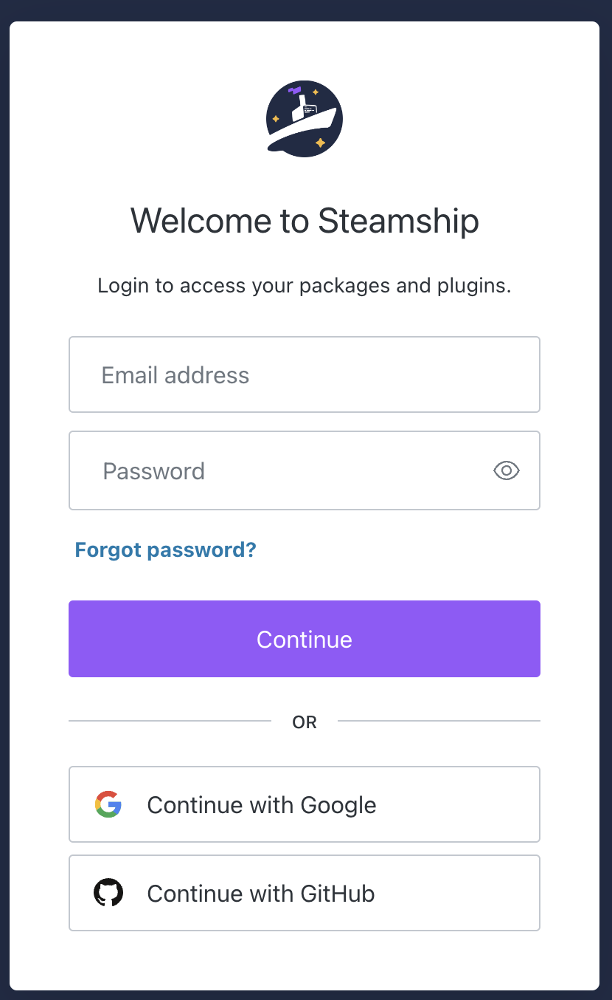
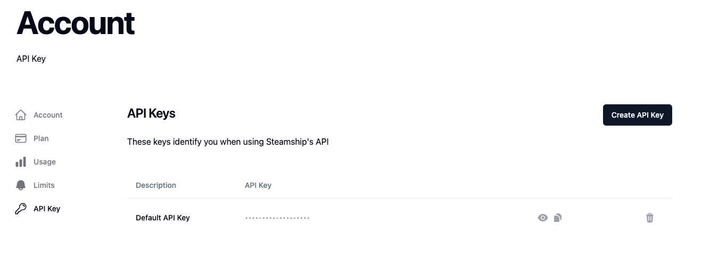

.. _Setup:

Setup Your Account
==================

In order to use Steamship, you'll need to establish a Steamship account in order to gain access to a Steamship API Key.
Steamship uses API Keys to authenticate requests and track platform usage (for billing, etc.).

Account Creation
^^^^^^^^^^^^^^^^

To create your account, visit: https://www.steamship.com/api/auth/login

Currently, you may **only** create a new Steamship account with an existing Github or Google account. We hope to extend
support to authenticated email users in the future.

Example account creation / login screen:

Please select either ``Continue with Google`` or ``Continue with Github`` from that screen to create your account.

Finding your API Key
^^^^^^^^^^^^^^^^^^^^

Once you have created an account, you can find your API Key via: https://www.steamship.com/account/api

Example API Key page:

